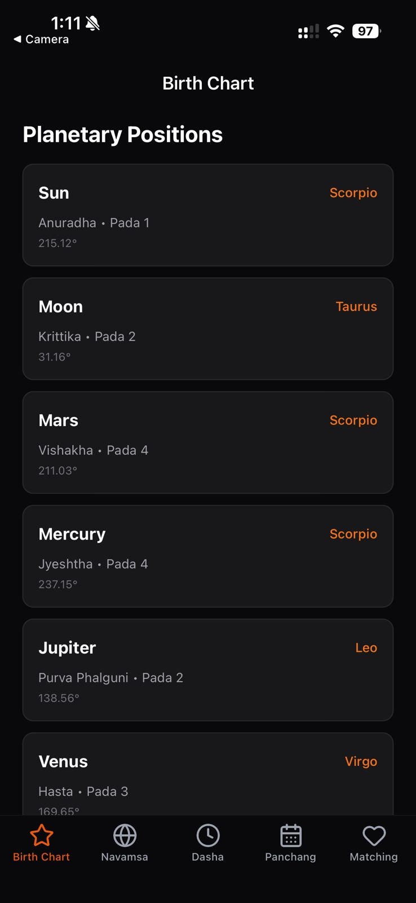
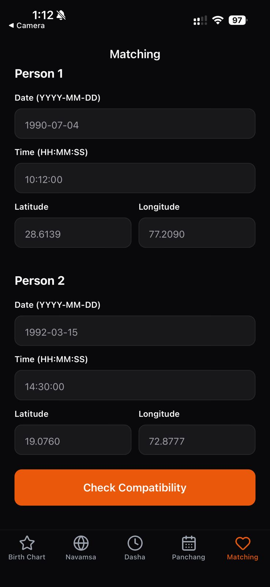
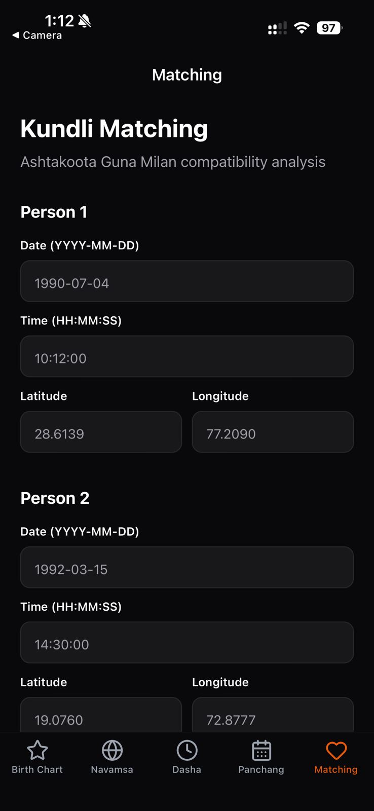
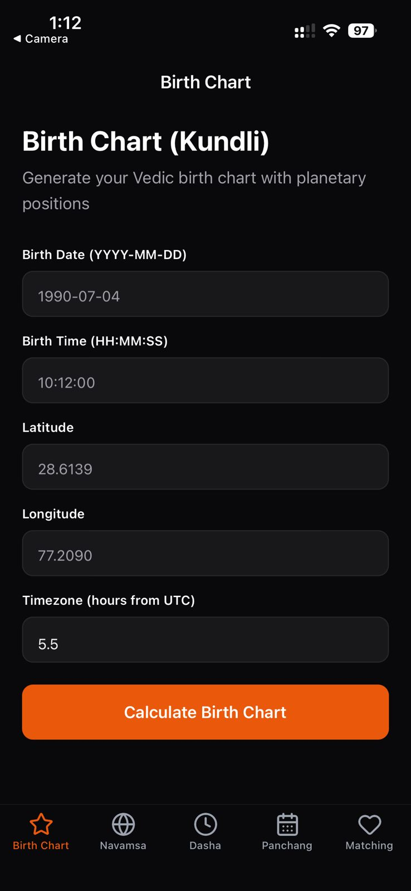

# Vedic Astrology Starter App

[](https://roxyapi.com/pricing)
[](https://roxyapi.com/api-reference#tag/vedic-astrology)
[](LICENSE)

Open-source React Native (Expo) template for a Vedic astrology app: Kundli (D1 Rashi chart), Navamsa (D9), Vimshottari Dasha, detailed Panchang, and Ashtakoota Guna Milan matching. Built on the [Roxy](https://roxyapi.com) Vedic Astrology API and the official [@roxyapi/sdk](https://www.npmjs.com/package/@roxyapi/sdk). One API key, every Jyotish and KP endpoint, full control over your native UI.

Fork it, set one environment variable, and ship.

## Screenshots

<p align="center">
  
  
  
  
</p>

## What you get

- **Birth Chart (Kundli)** with all nine grahas grouped by rashi, plus nakshatra and pada for each planet.
- **Navamsa (D9)** divisional chart for marriage and spiritual analysis, with Vargottama planet detection.
- **Dasha periods** showing the running Mahadasha, Antardasha, and Pratyantardasha with dates and interpretation.
- **Detailed Panchang** with Tithi, Nakshatra, Yoga, Karana, Vara, sunrise and sunset, Rahu Kaal, and Abhijit Muhurta.
- **Kundli matching** with the 36-point Ashtakoota Guna Milan score and a koota by koota breakdown.
- **Birth-city geocoding** so users search a city instead of typing latitude, longitude, and timezone.
- **Dark mode** that follows the device setting.

## Stack

| Technology | Purpose |
|-----------|---------|
| [Expo SDK 54](https://expo.dev) | React Native runtime and build tooling |
| [Expo Router](https://docs.expo.dev/router/introduction/) | File-based navigation with bottom tabs |
| [@roxyapi/sdk](https://www.npmjs.com/package/@roxyapi/sdk) | Fully typed RoxyAPI client. One key, every domain. |
| [NativeWind v4](https://www.nativewind.dev) | Tailwind CSS for React Native |
| [Roxy Vedic Astrology API](https://roxyapi.com/products/vedic-astrology-api) | Kundli, dasha, panchang, dosha, and KP, verified against NASA JPL Horizons |

## Quick start

### 1. Clone and install

```bash
git clone https://github.com/RoxyAPI/vedic-astrology-starter-app.git
cd vedic-astrology-starter-app
npm install
```

### 2. Get your API key

Get instant access at **[roxyapi.com/pricing](https://roxyapi.com/pricing)**. One key unlocks every Vedic and KP endpoint. Add it to `.env`:

```
EXPO_PUBLIC_ROXYAPI_KEY=your-api-key-here
```

> **Bundled key caveat.** A mobile app has no server, so any `EXPO_PUBLIC_*` value is compiled into the build and can be read off a device. For production, use a key restricted to your bundle id in the dashboard, or route calls through a thin backend proxy that holds the real key. Never ship an unrestricted key.

### 3. Run

```bash
npm start          # dev server, then press i, a, or w
npm run ios        # iOS simulator (macOS only)
npm run android    # Android emulator
npm run web        # web
```

## How it works

The SDK is the only data layer. There is no generated schema file to keep in sync: `@roxyapi/sdk` ships its own types from the same OpenAPI spec the API serves, so a response flows straight into a screen with no glue code.

### One typed client

```ts
// src/api/client.ts
import { createRoxy } from '@roxyapi/sdk';

const key = process.env.EXPO_PUBLIC_ROXYAPI_KEY ?? '';
export const roxy = createRoxy(key);
export const hasApiKey = (): boolean => Boolean(key);
```

### Geocode first, then chart

Every chart needs latitude, longitude, and timezone. The app never asks a user to type coordinates: it geocodes the birth city through `roxy.location.searchCities`, then feeds the result into the chart call.

```ts
// src/api/vedic.ts
export const vedicApi = {
  searchCities: async (q) => unwrap(await roxy.location.searchCities({ query: { q } }), 'Failed to search cities').cities,
  getBirthChart: async (body) => unwrap(await roxy.vedicAstrology.generateBirthChart({ body }), 'Failed to calculate birth chart'),
  // ...
};
```

```tsx
// app/(tabs)/index.tsx
const data = await vedicApi.getBirthChart({
  date, time, latitude: city.latitude, longitude: city.longitude, timezone: city.timezone,
});
```

## Featured endpoints

The highest-demand Vedic endpoints, in the order you are most likely to ship them. Every method name and field below comes from the [OpenAPI spec](https://roxyapi.com/api/v2/vedic-astrology/openapi.json).

```ts
import { createRoxy } from '@roxyapi/sdk';

const roxy = createRoxy(process.env.EXPO_PUBLIC_ROXYAPI_KEY!);

// 0. Geocode the birth city. timezone is the IANA string, passed straight into any chart.
const { data: places } = await roxy.location.searchCities({ query: { q: 'Delhi, India' } });
const { latitude, longitude, timezone } = places.cities[0];

// 1. Kundli (D1 Rashi chart). The top India astrology query, the entry point for every Jyotish product.
const { data: kundli } = await roxy.vedicAstrology.generateBirthChart({
  body: { date: '1990-07-04', time: '10:12:00', latitude, longitude, timezone },
});

// 2. Detailed Panchang. Tithi, nakshatra, yoga, karana, Rahu Kaal, and the muhurtas in one call.
const { data: panchang } = await roxy.vedicAstrology.getDetailedPanchang({
  body: { date: '2026-05-23', latitude, longitude, timezone },
});

// 3. Vimshottari Dasha. The running Mahadasha, Antardasha, and Pratyantardasha with remaining time.
const { data: dasha } = await roxy.vedicAstrology.getCurrentDasha({
  body: { date: '1990-07-04', time: '10:12:00', latitude, longitude, timezone },
});

// 4. Manglik (Mangal) Dosha. The most-asked matrimonial question in India.
const { data: dosha } = await roxy.vedicAstrology.checkManglikDosha({
  body: { date: '1990-07-04', time: '10:12:00', latitude, longitude, timezone },
});

// 5. Ashtakoota Guna Milan. The 36-point matrimonial compatibility score.
const { data: milan } = await roxy.vedicAstrology.calculateGunMilan({
  body: {
    person1: { date: '1990-07-04', time: '10:12:00', latitude, longitude, timezone },
    person2: { date: '1992-03-15', time: '14:30:00', latitude, longitude, timezone },
  },
});

// 6. KP ruling planets. Horary answers for real-time "will X happen" questions.
const { data: kp } = await roxy.vedicAstrology.getKpRulingPlanets({ body: { latitude, longitude, timezone } });

// 7. Navamsa (D9). The marriage and spiritual divisional chart, with Vargottama detection.
const { data: navamsa } = await roxy.vedicAstrology.generateNavamsa({
  body: { date: '1990-07-04', time: '10:12:00', latitude, longitude, timezone },
});
```

This template uses 6 of the 43 Vedic endpoints. Browse the rest in the [API reference](https://roxyapi.com/api-reference#tag/vedic-astrology).

## Project structure

```
app/                          # Expo Router screens
├── _layout.tsx               # Root Stack, shows the setup hint when no key is set
├── (tabs)/
│   ├── _layout.tsx           # Bottom tabs
│   ├── index.tsx             # Birth Chart (Kundli)
│   ├── navamsa.tsx           # Navamsa (D9)
│   ├── dasha.tsx             # Vimshottari Dasha
│   ├── panchang.tsx          # Detailed Panchang
│   └── compatibility.tsx     # Ashtakoota Guna Milan matching
src/
├── api/
│   ├── client.ts             # The one Roxy SDK client + hasApiKey guard
│   ├── vedic.ts              # Wraps roxy.vedicAstrology.* and roxy.location.*, unwraps { data, error }
│   ├── types.ts              # SDK response types under app-friendly names
│   └── index.ts              # Barrel export
├── components/
│   ├── CitySearch.tsx        # Geocoding picker, feeds lat/lon/timezone into any chart
│   └── RoxyBranding.tsx      # Setup screen shown when no API key is configured
├── constants/colors.ts       # appColors for React Native props
└── hooks/useUserId.ts        # Stable device id in AsyncStorage
```

## Customize

- **Add a feature.** Pick a Vedic method, add a wrapper in `src/api/vedic.ts`, call it from a screen. The SDK types regenerate from the spec, so new endpoints flow through with no manual typing.
- **Change the theme.** This app uses Tailwind colors through NativeWind. Swap `orange-600` in the screen `className` strings for any Tailwind color, and update `appColors.primary` in `src/constants/colors.ts` for the React Native props.
- **Add a dosha or KP screen.** The data layer already wraps `checkManglikDosha`, `checkKalsarpaDosha`, `checkSadhesati`, and `getKpRulingPlanets`, so a new screen is one component plus one tab.

## Why Roxy

- **Breadth.** Vedic astrology plus Western astrology, numerology, tarot, biorhythm, I Ching, crystals, dreams, and angel numbers under one key.
- **Type-safe.** The SDK types come from one OpenAPI pipeline, so response shapes cannot drift from what the API returns.
- **Eight languages.** Pass `query: { lang }` on the interpretation endpoints for English, Hindi, Turkish, Spanish, German, Portuguese, French, or Russian.
- **Remote MCP.** Connect AI agents to every Vedic endpoint at `roxyapi.com/mcp/vedic-astrology`, no local setup.

## Links

- [Vedic Astrology API](https://roxyapi.com/products/vedic-astrology-api)
- [API reference and playground](https://roxyapi.com/api-reference#tag/vedic-astrology)
- [Get API key](https://roxyapi.com/pricing)
- [All templates](https://roxyapi.com/starters)
- [Connect AI agents via MCP](https://roxyapi.com/docs/mcp)

## License

MIT
